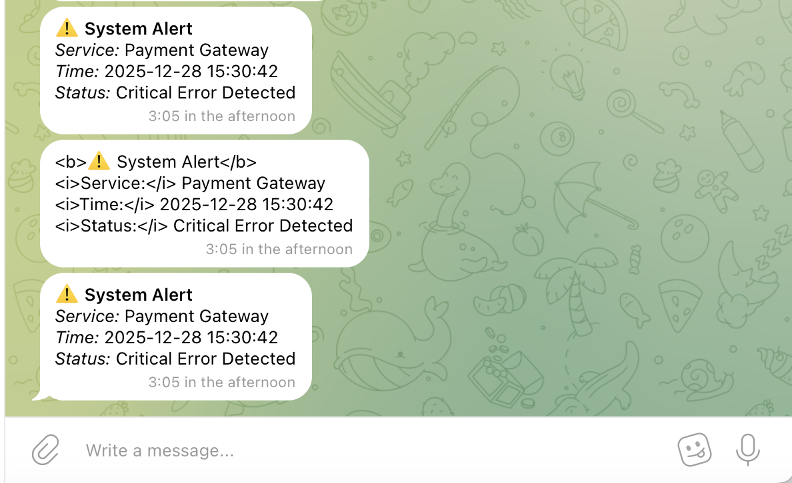
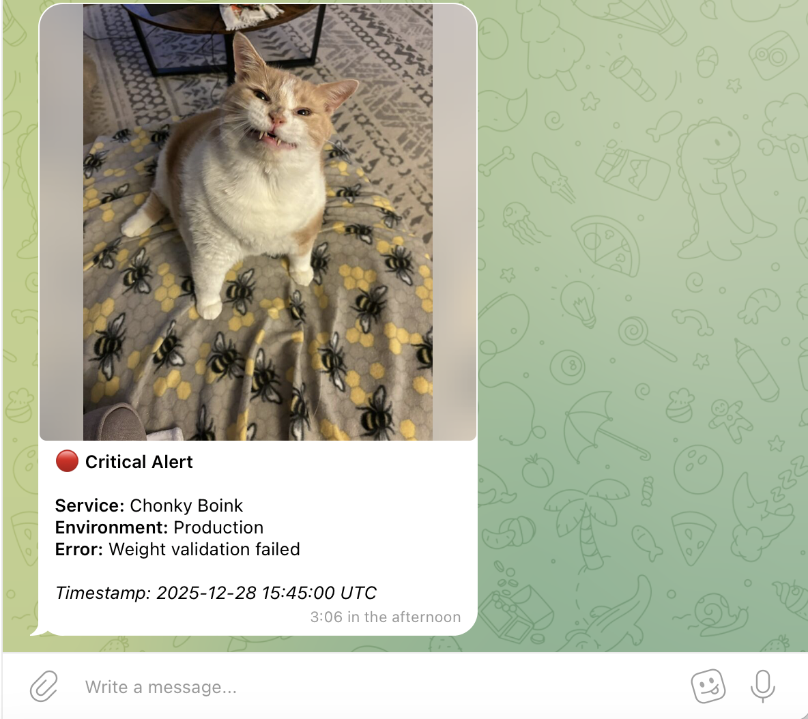

# Telegram Logs API

Send log messages to Telegram channels/groups via REST API. Built with Fiber and go-telegram/bot for high performance.

## Setup

1. Get your bot token from [@BotFather](https://t.me/BotFather)

2. Copy `.env.example` to `.env` and configure:
```bash
cp .env.example .env
```

3. Run with Docker:
```bash
# Build and start
docker compose up -d

# View logs
docker compose logs -f

# Stop
docker compose down
```

Or run directly with Go:
```bash
go run main.go
```

## Generate JWT Token

```bash
go run cmd/generate-token/main.go -client "my-service"
```

## Usage

**Health Check**
```bash
curl http://localhost:8080/health
```

### Send Text Message

```bash
curl -X POST http://localhost:8080/api/v1/log \
  -H "Authorization: Bearer YOUR_JWT_TOKEN" \
  -F "chat_id=-1001234567890" \
  -F "message=<b>Database Connection Error</b>
Server: prod-db-01
Status: Connection timeout after 30s"
```



### Send Photo with File Upload (Bekkie Photo :D)

```bash
curl -X POST http://localhost:8080/api/v1/log \
  -H "Authorization: Bearer YOUR_JWT_TOKEN" \
  -F "chat_id=-1001234567890" \
  -F "media_type=photo" \
  -F "file=@assets/send_photo.png" \
  -F "caption=<b>🔴 Critical Alert</b>
<b>Service:</b> Chonky Boink
<b>Environment:</b> Production
<b>Error:</b> Weight validation failed
<i>Timestamp: 2025-12-28 15:45:00 UTC</i>"
```



### Send Document

```bash
curl -X POST http://localhost:8080/api/v1/log \
  -H "Authorization: Bearer YOUR_JWT_TOKEN" \
  -F "chat_id=-1001234567890" \
  -F "media_type=document" \
  -F "file=@logs/error.log" \
  -F "caption=<b>Error Logs</b>
Generated: 2025-12-28
Size: 2.4 MB"
```

### Send Video

```bash
curl -X POST http://localhost:8080/api/v1/log \
  -H "Authorization: Bearer YOUR_JWT_TOKEN" \
  -F "chat_id=-1001234567890" \
  -F "media_type=video" \
  -F "file=@recordings/bug-reproduction.mp4" \
  -F "caption=<b>Bug Reproduction Video</b>
Issue: UI freeze on checkout
Duration: 45 seconds"
```

### HTML Formatting Examples

The API supports HTML formatting in messages and captions (default parse_mode is HTML):

```bash
# Bold and Italic
-F "message=<b>Bold text</b> and <i>italic text</i>"

# Code and Links
-F "message=Error in <code>payment.processTransaction()</code>
Details: <a href='https://docs.example.com/errors/500'>Error 500</a>"

# Multi-line formatted message
-F "caption=<b>⚠️ System Alert</b>

<b>Service:</b> Authentication
<b>Error:</b> JWT validation failed
<b>Affected:</b> 1,247 users

<i>Timestamp: 2025-12-28 15:45 UTC</i>"
```

## Get Chat ID

1. Add your bot to the channel/group
2. Forward a message from the channel to [@userinfobot](https://t.me/userinfobot)
3. Copy the chat ID (starts with `-100`)

## Config

| Variable | Description | Default |
|----------|-------------|---------|
| `TELEGRAM_BOT_TOKEN` | Bot token from BotFather | Required |
| `JWT_SECRET` | Secret for JWT signing | Required |
| `SERVER_PORT` | Server port | `8080` |
| `RATE_LIMIT` | Max requests per window | `100` |
| `RATE_LIMIT_WINDOW` | Window in seconds | `60` |
